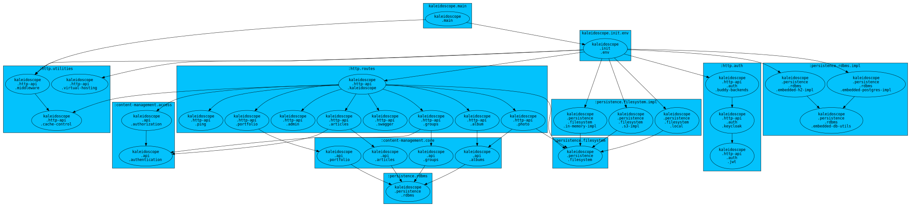

# Kaleidoscope


[Kaleidoscope](https://kaleidoscope.pub) is a content management system for blogging.  

This repository is the backend. It contains:

- **Backend**: Clojure web server that serves a content management system (kaleidoscope)  
- **Infrastructure**: Terraform for AWS cloud infrastructure  

## How the Kaleidoscope CMS works
The Kaleidoscope backend is built to host multiple different user sites at the
same time. To do this, the Kaleidoscope server inspects incoming HTTP requests
and determines which site is the target by looking at the HTTP request's Host
header (e.g. is this request for `andrewslai.com` or for `caheriaguilar.com`?).
Then, it determines if the user has permissions to access the resources for that
site and serves the resources if the user has the correct permissions.

## Architecture of the Clojure namespaces


Figure 1. A high level view of the architecture of the Clojure namespaces in the app.

The Kaleidoscope app has 3 distinct layers: 
1. Persistence layer: The layer responsible for storing/retrieving all of the
   key data structures. 
2. Api: The layer responsible for encoding the logic of how the key data
   structures should behave. 
3. HTTP Api. The layer that exposes the Api to the outside world.

## App startup 

At start time, the `kaleidoscope.main` namespace uses the
`kaleidoscope.init.env` namespace to parse environment variables and determine
how to boot the components needed to start the app.

The `kaleidoscope.init.env` namespace has `boot-instructions` that change how
the app starts up based on the environment. For example, the
`database-boot-instructions` (shown below) define 3 different possible ways to
start the Database component. Which one starts depends on the value in the
`KALEIDOSCOPE_DB_TYPE` environment variable. 

``` clojure
(def database-boot-instructions
  {:name      :database-connection
   :path      "KALEIDOSCOPE_DB_TYPE"
   :launchers {"postgres"          (fn  [env]
                                     (let [ds (connection/->pool HikariDataSource
                                                                 (env->pg-conn env))]
                                       (initialize-connection-pool! ds)
                                       ds))
               "embedded-h2"       (fn [_env] (embedded-h2/fresh-db!))
               "embedded-postgres" (fn [_env] (embedded-pg/fresh-db!))}
   :default   "postgres"})
```

For example, if `KALEIDOSCOPE_DB_TYPE=postgres` then the app will use the
`postgres` launcher to start the database.

### App startup options

`KALEIDOSCOPE_DB_TYPE`: Determines what database type to use

| Value             | Description                                                                 |
|-------------------|-----------------------------------------------------------------------------|
| postgres          | Connect to an external Postgres instance                                    |
| embedded-h2       | Start an in-JVM, ephemeral H2 instance, seeded with some example data       |
| embedded-postgres | Start an in-JVM, ephemeral Postgres instance, seeded with some example data |


`KALEIDOSCOPE_AUTH_TYPE` Determines how to authenticate users

| Value                  | Description                                                                                                            |
|------------------------|------------------------------------------------------------------------------------------------------------------------|
| keycloak               | Connect to a Keycloak instance for Authentication. Makes a network request for Auth.                                   |
| always-unauthenticated | Always return an unauthenticated user. Does not make a network request.                                                |
| always-authenticated   | Always return an authenticated user with admin permissions on the supported `domains`. Does not make a network request |


`KALEIDOSCOPE_AUTHORIZATION_TYPE` Determines how to authorize users

| Value                   | Description                                                     |
|-------------------------|-----------------------------------------------------------------|
| public-access           | Allow any authenticated user to access all resources            |
| use-access-control-list | Use `KALEIDOSCOPE-ACCESS-CONTROL-LIST` to determine permissions |


`KALEIDOSCOPE_STATIC_CONTENT_TYPE` Determine where to look for static resources

| Value            | Description                                                      |
|------------------|------------------------------------------------------------------|
| none             | Don't set up any static resources                                |
| s3               | Use S3 to serve static resources. Must be able to connect to AWS |
| in-memory        | Use an in-memory filesystem. Useful for testing                  |
| local-filesystem | Serve static content from the local filesystem                   |

Some launch options require additional environment variables to start up (e.g.
databases need connection variables). If you don't supply these variables, the
app will send verbose error messages to help you configure the environment
properly.

## Installation/setup
Clone the repo and install [leiningen](https://leiningen.org/).  

#### Build: Uberjar
```bash
lein do clean, uberjar
```

#### Build: Docker
```bash
lein do clean, uberjar
docker build -t kaleidoscope .
```

#### Run without Docker
``` bash
lein run
```

#### Run with Docker
After docker build and setting up `.env.docker.local` with correct environment

``` bash
docker run --env-file=.env.docker.local -p 5000:5000 kaleidoscope
```

To serve a local copy of the Andrewslai frontend, mount a volume to the Docker
container.
``` bash
docker run --env-file=.env.docker.local \
            -p 5000:5000 \
            -v /Users/alai/spl/andrewslai-frontend/resources/public:/andrewslai-frontend/resources/public \
            kaleidoscope
```

#### Tests
```bash
lein test

```

## Development
For local development, see [local-development.md](./docs/local-development.md)

## Deployment
To deploy, follow instructions in [deployment.md](./docs/deployment.md)
