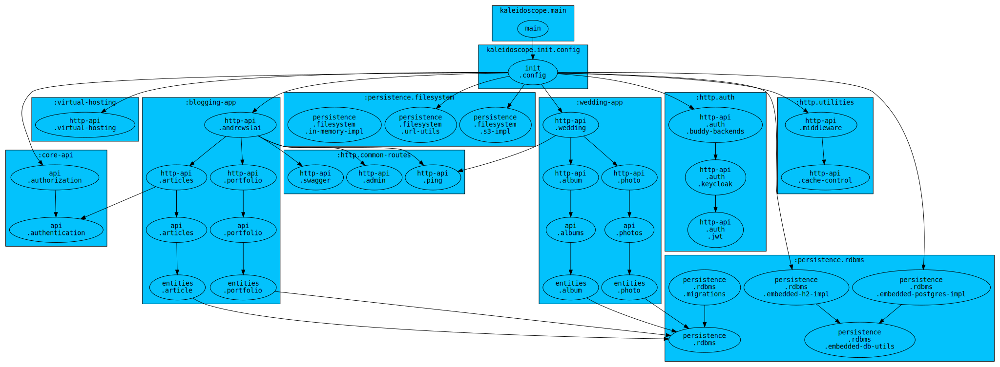

# andrewslai

Welcome to my personal website! It is currently hosted at https://andrewslai.com.  

This repository is the website backend. It contains:

- **Backend**: Clojure web server on Java 11.  
- **Infrastructure**: Terraform for AWS cloud infrastructure  

## Architecture
The architecture of the app.


Figure 1. A high level view of the architecture of the app.

1. At start time, the `main` namespace uses the `init.config` namespace to parse
   environment variables and creates components to inject into the app
2. `init.config` starts components

### System Components
1. `:virtual-hosting`: Allows you to direct multiple DNS entries to the app and
   serve multiple websites/apps from a single instance. Used to serve separate apps
   on `andrewslai.com` and `caheriaguilar.and.andrewslai.com`.
2. `:persistence.rdbms`: The RDBMS used as a persistence store. Depending on
   environment variables, could be set to a live Postgres instance that is
   accessible via the network, or could start an embedded DB for testing.
3. `:persistence.filesystem`: Starts a Filesystem used to store pictures and media.
   Could be an S3 implementation, or an in-memory filesystem for testing.
4. `:http-api.middleware` (Static-Content): If static content is enabled, allows you to serve
   content from the Persistence.Filesystem implementation - i.e. a request to
   `/media/foo.svg` would try to look up the content located at path
   `/media/foo.svg` in the `:persistence.filesystem`. Basically, a thin wrapper
   that serves the S3 bucket via the Ring server.
5. `:http.auth`: Used to configure how users Authenticate over HTTP. Can use
   different `buddy` backends. The normal implementaiton is a Keycloak backend,
   which reaches out to a live Keycloak server over the network, but this can be
   overridden to always provide an authenticated/unauthenticated user (for
   testing).

### Additional configuration
1. `init.config` HTTP Access rules: Can be set at run time to protect http
routes behind role-based access criteria.

## Installation/setup
Clone the repo and install [leiningen](https://leiningen.org/).  

#### Tests
```bash
lein test

```

#### Build: Uberjar
```bash
lein do clean, uberjar
```

#### Build: Docker
```bash
lein do clean, uberjar
docker build -t andrewslai .
```

#### Run without Docker
``` clojure
lein run
```

#### Run with Docker
After docker build and setting up `.env.local` with correct environment

``` clojure
docker run --env-file=.env.local -p 5000:5000 andrewslai
```

## Development
For local development, see [local-development.md](./docs/local-development.md)

## Deployment
To deploy, follow instructions in [deployment.md](./docs/deployment.md)
